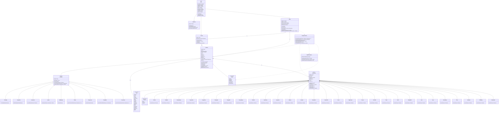

```mermaid
classDiagram
    %% Enumeraciones
    class Tipo {
        <<enumeration>>
        NORMAL
        FUEGO
        AGUA
        PLANTA
        ELÉCTRICO
        HIELO
        LUCHA
        VENENO
        TIERRA
        VOLADOR
        PSÍQUICO
        BICHO
        ROCA
        FANTASMA
        DRAGÓN
        SINIESTRO
        ACERO
        HADA
    }

    class Categoria {
        <<enumeration>>
        FISICO
        ESPECIAL
        ESTADO
    }

    class Estado {
        <<enumeration>>
        NORMAL
        QUEMADO
        DORMIDO
        CONGELADO
        PARALIZADO
        ENVENENADO
    }

    %% Core Classes
    class Main {
        <<Main>>
        -RotomWash: Pokemon
        -Garchomp: Pokemon
        -Togekiss: Pokemon
        -Metagross: Pokemon
        -Milotic: Pokemon
        -Arcanine: Pokemon
        -Amoonguss: Pokemon
        -Dragapult: Pokemon
        -Excadrill: Pokemon
        -Sylveon: Pokemon
        
        +main(String[])
        -inicializarPokemon()
        -crearRival() Persona
    }

    class Persona {
        -nombre: String
        -listaPokemon: ArrayList~Pokemon~
        +setNombre(String)
        +crearEquipo() ArrayList
        +verEquipo()
        +getListaPokemon() ArrayList
    }

    class Pokemon {
        -nombre: String
        -nivel: int
        -tipos: ArrayList~Tipo~
        -habilidad: Habilidad
        -ps: int
        -atack: int
        -defense: int
        -spAtack: int
        -spDefense: int
        -speed: int
        -estado: Estado
        -movimientos: ArrayList~Movimiento~
        -ModPs: int
        +crearCopia() Pokemon
        +prepararParaBatalla()
        +volverAEntrar()
        +sufrirDaño(int)
        +estaDebilitado() boolean
        +getNombre() String
        +getMovimientos() ArrayList
    }

    class Battle {
        -jugador1: Persona
        -jugador2: Persona
        -pokemonActual1: Pokemon
        -pokemonActual2: Pokemon
        -battleFinished: boolean
        +iniciarBattle()
        -ejecutarTurno()
        -atacar(Pokemon, Pokemon, Movimiento)
        -terminarBattle()
        -hayPokemonVivo(Persona) boolean
        -cambiarPokemon(Persona, Pokemon, Scanner) Pokemon
    }

    class GameView {
        -scanner: Scanner
        +showWelcome()
        +mostrarEquipo(Persona)
        +iniciarSeleccionEquipo(Persona)
        +seleccionarnombre(Persona)
    }

    %% Utility Classes
    class DamageCalculator {
        $ +calculateDamage(Pokemon, Pokemon, Movimiento) int
        $ +applyDamage(Pokemon, int, Pokemon, Movimiento)
        $ +aplicarDañoPorEstado(Pokemon)
        $ +getVelocityMultiplier(Pokemon) double
        - aplicarModificador(int, int) int
        - isCriticalHit(Pokemon, Movimiento) boolean
    }

    class TypeEffectiveness {
        $ -EFFECTIVENESS_MAP: Map
        $ +getEffectiveness(Tipo, Tipo) double
        $ +getTotalEffectiveness(Tipo, ArrayList) double
        $ +getEffectivenessDescription(double) String
    }

    %% Habilidades (Abilities)
    class Habilidad {
        <<abstract>>
        #nombre: String
        +getNombre() String
        +efecto(Pokemon)
        +efectoAlEntrar(Pokemon, Pokemon)
        +efectoAlRecibirDaño(Pokemon, int, Movimiento)
        +esInmune(Pokemon, Movimiento) boolean
    }

    class ClearBody {
        +PuedenBajarStats(Pokemon)
    }

    class Competitive {
        +alRecibirBajadaDeStat(Pokemon)
    }

    class Intimidacion {
        +efectoAlEntrar(Pokemon, Pokemon)
    }

    class Levitate {
        +esInmune(Pokemon, Movimiento) boolean
    }

    class MoldBreaker {
        +efecto(Pokemon)
    }

    class Pixilate {
        +antesDeCalcularDaño(Pokemon, Movimiento) Tipo
    }

    class Regenerator {
        +efectoalCambiar(Pokemon)
    }

    class RoughSkin {
        +efectoAlRecibirDaño(Pokemon, int, Movimiento)
    }

    class SereneGrace {
        +antesDeCalcularefecto(Pokemon, Movimiento) int
    }

    %% Movimientos (Moves)
    class Movimiento {
        <<abstract>>
        #nombre: String
        #prioridad: int
        #tipo: Tipo
        #categoria: Categoria
        #potencia: int
        #precision: int
        #pp: int
        #multcrit: int
        +getNombre() String
        +getTipo() Tipo
        +getCategoria() Categoria
        +getPotencia() int
        +getPrecision() int
        +getPrioridad() int
        +efecto(Pokemon, Pokemon)
    }

    class AirSlash {
        +efecto(Pokemon, Pokemon)
    }

    class CalmMind {
        +efecto(Pokemon, Pokemon)
    }

    class DazzlingGleam {
        +efecto(Pokemon, Pokemon)
    }

    class DragonClaw {
        +efecto(Pokemon, Pokemon)
    }

    class DragonPulse {
        +efecto(Pokemon, Pokemon)
    }

    class Earthquake {
        +efecto(Pokemon, Pokemon)
    }

    class EnergyBall {
        +efecto(Pokemon, Pokemon)
    }

    class ExtremeSpeed {
        +efecto(Pokemon, Pokemon)
    }

    class FlareBlitz {
        +efecto(Pokemon, Pokemon)
    }

    class HydroPump {
        +efecto(Pokemon, Pokemon)
    }

    class HyperVoice {
        +efecto(Pokemon, Pokemon)
    }

    class IceBeam {
        +efecto(Pokemon, Pokemon)
    }

    class IronHead {
        +efecto(Pokemon, Pokemon)
    }

    class MeteorMash {
        +efecto(Pokemon, Pokemon)
    }

    class MysticalFire {
        +efecto(Pokemon, Pokemon)
    }

    class Protect {
        +efecto(Pokemon, Pokemon)
    }

    class RagePowder {
        +efecto(Pokemon, Pokemon)
    }

    class Recover {
        +efecto(Pokemon, Pokemon)
    }

    class RockSlide {
        +efecto(Pokemon, Pokemon)
    }

    class Roost {
        +efecto(Pokemon, Pokemon)
    }

    class Scald {
        +efecto(Pokemon, Pokemon)
    }

    class ShadowBall {
        +efecto(Pokemon, Pokemon)
    }

    class Snarl {
        +efecto(Pokemon, Pokemon)
    }

    class Spore {
        +efecto(Pokemon, Pokemon)
    }

    class SwordDance {
        +efecto(Pokemon, Pokemon)
    }

    class UTurn {
        +efecto(Pokemon, Pokemon)
    }

    class VoltSwitch {
        +efecto(Pokemon, Pokemon)
    }

    class WillOWisp {
        +efecto(Pokemon, Pokemon)
    }

    class ZenHeadbutt {
        +efecto(Pokemon, Pokemon)
    }

    %% Relations
    Main --> GameView
    Main --> Persona
    Main --> Battle
    
    Battle o-- Persona: "2"
    Battle o-- Pokemon: "2"
    
    Persona o-- Pokemon: "1..4"
    
    Pokemon o-- Habilidad
    Pokemon o-- Tipo: "1..2"
    Pokemon o-- Estado
    Pokemon *-- Movimiento: "4"
    
    Movimiento o-- Tipo
    Movimiento o-- Categoria
    
    DamageCalculator ..> Pokemon
    DamageCalculator ..> Movimiento
    DamageCalculator ..> TypeEffectiveness
    DamageCalculator ..> Estado
    
    Battle ..> DamageCalculator
    
    Habilidad <|-- ClearBody
    Habilidad <|-- Competitive
    Habilidad <|-- Intimidacion
    Habilidad <|-- Levitate
    Habilidad <|-- MoldBreaker
    Habilidad <|-- Pixilate
    Habilidad <|-- Regenerator
    Habilidad <|-- RoughSkin
    Habilidad <|-- SereneGrace
    
    Movimiento <|-- AirSlash
    Movimiento <|-- CalmMind
    Movimiento <|-- DazzlingGleam
    Movimiento <|-- DragonClaw
    Movimiento <|-- DragonPulse
    Movimiento <|-- Earthquake
    Movimiento <|-- EnergyBall
    Movimiento <|-- ExtremeSpeed
    Movimiento <|-- FlareBlitz
    Movimiento <|-- HydroPump
    Movimiento <|-- HyperVoice
    Movimiento <|-- IceBeam
    Movimiento <|-- IronHead
    Movimiento <|-- MeteorMash
    Movimiento <|-- MysticalFire
    Movimiento <|-- Protect
    Movimiento <|-- RagePowder
    Movimiento <|-- Recover
    Movimiento <|-- RockSlide
    Movimiento <|-- Roost
    Movimiento <|-- Scald
    Movimiento <|-- ShadowBall
    Movimiento <|-- Snarl
    Movimiento <|-- Spore
    Movimiento <|-- SwordDance
    Movimiento <|-- UTurn
    Movimiento <|-- VoltSwitch
    Movimiento <|-- WillOWisp
    Movimiento <|-- ZenHeadbutt
```
